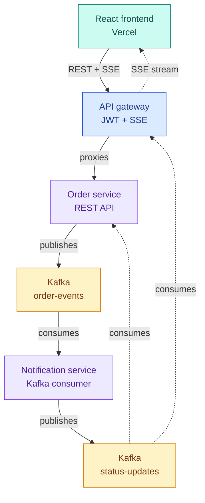

# event-order-stream

A real-time, event-driven order processing system. Built to get hands-on with the
parts of platform/DevOps work that don't show up in day-to-day maintenance —
designing a message contract between services, debugging cross-service serialization
and auth issues end to end, and operating a deployed system on real free-tier
infrastructure constraints rather than a clean local sandbox.

**Live demo:** https://event-order-stream.vercel.app/

## What it does

Create an order through the UI and watch its status update live — `pending` →
`processing` → `confirmed` (or occasionally `failed`, ~10% simulated rate) — with
no page refresh, no polling. The status change is driven entirely by Kafka events
flowing between three independent backend services, pushed to the browser over
Server-Sent Events (SSE).

## Architecture



- **order-service** — REST API for creating/listing orders, persists to Postgres,
  publishes to the `order-events` Kafka topic, and separately consumes
  `order-status-updates` to keep its own record in sync (it's the aggregate owner,
  so it reacts to the same downstream events the gateway broadcasts)
- **notification-service** — pure Kafka consumer (no REST API beyond a health
  endpoint). Consumes `order-events`, simulates processing with a randomized delay,
  publishes the final status to `order-status-updates`
- **gateway-service** — the only service the frontend talks to directly. Handles
  JWT-based auth (registration + login, BCrypt-hashed passwords, Postgres-backed),
  proxies order requests to `order-service`, and consumes `order-status-updates` to
  broadcast live updates to connected browsers over SSE
- **frontend** — React + Vite. Landing page, auth (login/register), order creation
  form, and a live dashboard consuming the gateway's SSE stream via `EventSource`

## Tech stack

**Backend:** Java 21, Spring Boot 3, Spring Security, Spring Kafka, Spring Data JPA,
JWT (JJWT), BCrypt, PostgreSQL, Apache Kafka protocol (Redpanda)
**Frontend:** React, Vite, vanilla CSS (no framework — custom glass/neon design system)
**Infra:** Docker, Docker Compose, GitHub Actions, Render, Vercel, Neon, Redpanda Cloud

## How the pieces actually deploy

| Component | Local dev | Production |
|---|---|---|
| Backend services | Docker Compose | Render (3 separate Web Services) |
| Frontend | Vite dev server | Vercel |
| Database | Postgres container | Neon (serverless Postgres) |
| Kafka | Redpanda (local Docker) | Redpanda Cloud Serverless |

Each backend service has three Spring profiles — `default` (H2 in-memory, for
running a single service standalone), `docker` (Postgres + plaintext Kafka, for
`docker-compose up`), and `prod` (Postgres + SASL_SSL Kafka auth, for Render).

## Run it locally

**1. Start the backend stack:**
```bash
docker compose up --build
```
This starts Postgres, Redpanda (+ a Redpanda Console UI on :8090 to inspect topics),
`order-service` (:8081), `notification-service` (background consumer), and
`gateway-service` (:8082).

**2. Start the frontend, in a separate terminal:**
```bash
cd frontend
npm install
cp .env.example .env
npm run dev
```
Open http://localhost:5173.

**3. Register an account** through the UI (or log in if you've already created one) —
there's no hardcoded demo login; accounts are real, Postgres-backed, BCrypt-hashed.

**4. Create an order** and watch its status update live.

## Local vs. production Kafka

Local dev runs on **Redpanda** — a from-scratch Kafka-protocol implementation, not a
fork, so `spring-kafka` producer/consumer code is identical either way. It's used
locally for its lighter footprint and faster startup than real Kafka + ZooKeeper in
Docker. Production runs on **Redpanda Cloud Serverless** — genuine hosted
Kafka-protocol infrastructure with SASL_SSL authentication. (Originally planned around
Upstash Kafka; Upstash discontinued that product in 2025, so the whole deployment
plan pivoted to Redpanda Cloud instead.)

## CI/CD

Two separate GitHub Actions workflows:

- **`ci.yml`** — runs on every push/PR to `main`. Builds and runs tests for all three
  backend services in parallel (a matrix job), plus builds the frontend. Catches
  compile errors, missing dependencies, and failing tests before they ever reach
  Render — `order-service`'s test suite includes a real `@EmbeddedKafka` integration
  test exercising the actual Kafka producer/consumer path, not just unit tests.
- **`keep-alive.yml`** — pings all three backend services every 10 minutes (with
  retry/backoff) to prevent Render's free tier from spinning services down after 15
  minutes of inactivity. GitHub doesn't guarantee exact scheduled-run timing, so this
  is a best-effort mitigation, not a hard guarantee — see Known Limitations below.

## Known limitations (free-tier hosting)

- Render's shared 750 free instance-hours/month cap applies across all three backend
  services — heavy testing can occasionally trigger rate limiting (`429`) regardless
  of the keep-alive workflow
- GitHub Actions scheduled workflows aren't guaranteed to run at exact intervals
  during high platform load, so a service can still occasionally spin down before the
  next scheduled ping arrives
- Redpanda Cloud Serverless is on a 30-day free trial, not a permanent free tier —
  will need periodic renewal to keep the Kafka cluster alive
- First request after a cold start can take 30–60 seconds while Render wakes the
  container

## What's not built yet

- Rate-limit-aware retry/backoff in the frontend itself (currently surfaces Render's
  `429` responses directly to the user rather than retrying transparently)
